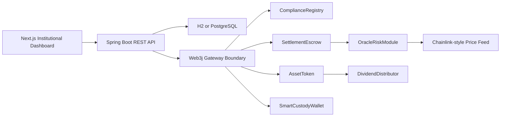

# Atlas Settlement

Atlas Settlement is an institutional fintech blockchain portfolio project for tokenized asset issuance, compliant transfer, smart contract custody, delivery-versus-payment settlement, oracle risk checks, and asset servicing on Ethereum-compatible networks.

The project is intentionally built around financial-services blockchain use cases rather than consumer Web3 patterns. It demonstrates Solidity smart contract engineering, enterprise-style Java/Spring Boot integration, relational persistence, operational dashboarding, audit events, and security documentation.

## Problem Statement

Financial institutions exploring digital assets need more than a token contract. They need controlled issuance, approved investor transfer rules, custody policies, settlement workflows, risk checks, auditability, and integration with existing enterprise systems.

Atlas Settlement models a simplified institutional lifecycle:

1. A compliance officer verifies investor wallets.
2. An issuer mints a tokenized asset to approved participants.
3. A seller creates a delivery-versus-payment settlement.
4. The asset moves into escrow.
5. The buyer approves stablecoin payment.
6. The settlement contract checks oracle freshness and price deviation.
7. The trade settles atomically: payment to seller, asset to buyer.
8. Custody wallets enforce daily limits and signer approvals.
9. Dividend or coupon distribution services the asset after issuance.

This is the kind of workflow expected in digital asset platforms for tokenized funds, private credit, treasuries, real estate shares, or other permissioned financial instruments.

## Architecture Overview



### Key Design Decisions

- Solidity and Foundry for smart contracts and tests.
- Spring Boot for enterprise API structure.
- H2 by default so the backend can run without Docker.
- PostgreSQL-ready configuration for production-style persistence.
- Web3j gateway boundary for blockchain integration.
- Next.js dashboard styled as an internal financial operations console.
- Security-first documentation and test coverage around core failure modes.

## Contract Descriptions

### `ComplianceRegistry.sol`

Maintains the list of verified investor wallets. Compliance officers can mark addresses as approved or revoked. The asset token and settlement escrow use this registry to enforce permissioned participation.

### `AssetToken.sol`

A permissioned ERC-20-style token representing a tokenized financial asset. Transfers require both sender and recipient to be verified. Issuance is restricted to approved minters.

### `SettlementEscrow.sol`

Handles delivery-versus-payment settlement. The seller funds the escrow with tokenized assets, the buyer approves stablecoin payment, and final settlement transfers both legs in one controlled flow after risk checks pass.

### `SmartCustodyWallet.sol`

A programmable custody wallet with operator permissions, daily transfer limits, signer approval for large transfers, and emergency pause. It demonstrates smart contract wallet concepts used in institutional custody.

### `OracleRiskModule.sol`

Reads Chainlink-style oracle data through `latestRoundData()`. It checks that the price is positive, `updatedAt` is recent, and price movement is within an allowed circuit-breaker threshold.

### `DividendDistributor.sol`

Models asset servicing by distributing stablecoin dividends or coupon payments to holders of the tokenized asset.

### Test Mocks

The repo includes mock ERC-20 and mock oracle contracts for deterministic local tests.

## Backend/API Overview

The backend is a Spring Boot service that represents how a financial institution would integrate blockchain workflows into existing systems.

Current API surface:

```text
POST /investors/verify
POST /assets/issue
POST /settlements/create
POST /settlements/{id}/approve
GET  /settlements/{id}
GET  /audit-log
```

Backend responsibilities:

- Store investor verification records.
- Store settlement orders.
- Write audit events.
- Validate API requests.
- Submit real local Anvil transactions to `SettlementEscrow.createSettlement`.
- Read deployed contract addresses from `deployments/anvil.json`.
- Support H2 locally and PostgreSQL through environment variables.

Current live flow: `POST /settlements/create` signs with the default Anvil seller key, calls the deployed `SettlementEscrow` contract through Web3j, waits for a receipt, stores the chain settlement id and transaction hash, and returns the created settlement.

## Frontend/Dashboard Overview

The frontend is a Next.js internal operations dashboard for financial users such as:

- issuer
- custodian
- transfer agent
- compliance officer
- settlement operator

Dashboard surfaces:

- tokenized AUM
- pending settlements
- verified investor count
- oracle health
- delivery-versus-payment queue
- custody wallet policy
- oracle and circuit-breaker status
- audit trail
- live local Anvil settlement creation

The dashboard includes a `New DVP` button that calls the Spring Boot backend and prepends the returned on-chain settlement to the settlement queue.

When deployed as a public Vercel preview, the dashboard is frontend-only. The `New DVP` button creates a clearly marked `LOCAL_PREVIEW` row unless `NEXT_PUBLIC_API_BASE_URL` points to a public backend. The real on-chain flow is the local Anvil + Spring Boot flow documented below.

## Repository Layout

```text
contracts/
  AssetToken.sol
  ComplianceRegistry.sol
  SettlementEscrow.sol
  SmartCustodyWallet.sol
  OracleRiskModule.sol
  DividendDistributor.sol
backend/
  src/main/java/com/atlas/settlement/
frontend/
  app/
script/
  DeployLocal.s.sol
deployments/
  anvil.json
test/
  AtlasSettlement.t.sol
SECURITY.md
INTERVIEW_NOTES.md
DEMO_SCRIPT.md
```

## Setup Instructions

### Prerequisites

- Foundry
- Node.js and npm
- Java 17 and Maven for backend execution

Docker is not required. The backend defaults to in-memory H2 so it can run without a local database container.

### Install Contract Dependencies

```bash
forge install foundry-rs/forge-std
```

### Live Local Anvil Flow

Use four terminals from the repository root.

#### 1. Start Anvil

```bash
anvil --host 127.0.0.1 --port 8545
```

#### 2. Deploy Contracts

```bash
forge script script/DeployLocal.s.sol:DeployLocal --rpc-url http://127.0.0.1:8545 --broadcast
```

This deploys:

- `ComplianceRegistry`
- `AssetToken`
- `MockStablecoin`
- `MockOracle`
- `OracleRiskModule`
- `SettlementEscrow`
- `SmartCustodyWallet`
- `DividendDistributor`

It writes deployed addresses to:

```text
deployments/anvil.json
```

The deploy script verifies the default Anvil seller and buyer, mints tokenized assets to the seller, mints mock stablecoin, and pre-approves the escrow from the seller account so the backend can create a settlement.

#### 3. Start Backend

If Java 17 and Maven are installed globally:

```bash
cd backend
mvn spring-boot:run
```

If using the local portable tools installed in `.tools` on Windows PowerShell:

```powershell
$env:JAVA_HOME="$PWD\.tools\jdk-17"
$env:Path="$env:JAVA_HOME\bin;$PWD\.tools\apache-maven-3.9.11\bin;$env:Path"
cd backend
mvn spring-boot:run
```

The backend reads `../deployments/anvil.json` by default.

#### 4. Start Frontend

```bash
cd frontend
npm install
npm run dev
```

Open:

```text
http://127.0.0.1:3000
```

#### 5. Create A Settlement

In the dashboard, click:

```text
New DVP
```

The frontend calls:

```text
POST http://127.0.0.1:8080/settlements/create
```

The backend sends a real `createSettlement` transaction to local Anvil and returns a chain transaction hash. The new settlement appears at the top of the dashboard settlement queue.

### Frontend-Only Vercel Preview

Deploy the `frontend` directory to Vercel as a visual portfolio preview. This is useful for sharing the institutional dashboard in an interview, but it does not run Anvil or the Spring Boot backend.

Recommended Vercel settings:

```text
Root Directory: frontend
Build Command: npm run build
Install Command: npm install
Output Directory: .next
```

For a real deployed settlement flow, deploy the Spring Boot API separately and set:

```text
NEXT_PUBLIC_API_BASE_URL=https://your-backend.example.com
```

You can also test the endpoint directly:

```powershell
$body = @{
  tradeReference = "DVP-LIVE-001"
  sellerWallet = "0x70997970C51812dc3A010C7d01b50e0d17dc79C8"
  buyerWallet = "0x3C44CdDdB6a900fa2b585dd299e03d12FA4293BC"
  assetAmount = "10"
  paymentAmount = "1000"
} | ConvertTo-Json

Invoke-RestMethod -Uri http://127.0.0.1:8080/settlements/create -Method Post -ContentType "application/json" -Body $body
```

Optional production-style database settings:

```bash
DATABASE_URL=jdbc:postgresql://localhost:5432/atlas
DATABASE_USERNAME=atlas
DATABASE_PASSWORD=atlas
ATLAS_RPC_URL=http://127.0.0.1:8545
ATLAS_SETTLEMENT_ESCROW=0x...
ATLAS_DEPLOYMENT_FILE=../deployments/anvil.json
ATLAS_SELLER_PRIVATE_KEY=0x...
```

## Testing Instructions

Run the smart contract test suite:

```bash
forge test
```

Current Foundry coverage includes:

- only whitelisted investors can receive tokenized assets
- settlement transfers asset and stablecoin atomically
- settlement fails if seller has not approved the asset
- settlement fails if buyer has not approved stablecoin payment
- unauthorized users cannot pause or change roles
- oracle module rejects stale prices
- oracle circuit breaker rejects abnormal price movement
- emergency pause blocks settlement
- reentrancy attempt fails
- dividend distribution works
- custody wallet daily limit and large-transfer approval
- fuzz tests for settlement amounts
- fuzz tests for oracle price bounds

Run the frontend production build:

```bash
cd frontend
npm run build
```

Run backend tests:

```bash
cd backend
mvn test
```

## Security Model

The project documents its security model in `SECURITY.md`.

Core risks and mitigations:

- Reentrancy: protected with `nonReentrant` and state updates before external transfers.
- Access control: owner, compliance officer, minter, operator, and signer responsibilities are separated.
- Oracle staleness: `updatedAt` must be inside the freshness window.
- Price manipulation: circuit-breaker threshold rejects abnormal oracle movement.
- Admin key compromise: production design should use multi-sig ownership and monitored admin actions.
- Settlement failure: settlement fails closed and keeps escrowed assets recoverable through cancellation.
- Smart contract wallet risk: custody uses operator limits, signer approvals, and emergency pause.
- Emergency pause: critical contracts can be paused during incident response.
- Testing strategy: Foundry tests cover core invariants, failure modes, fuzz inputs, and reentrancy attempts.

Short interview explanation:

> I treated Atlas like a financial-market workflow, not a normal token demo. The main risks are unauthorized transfers, stale oracle data, settlement failure, custody misuse, reentrancy, and admin key compromise. I mitigated those with verified-investor restrictions, oracle freshness checks, circuit breakers, reentrancy guards, role separation, pause controls, custody approval policies, and targeted Foundry tests.

## Demo Script

Use this sequence for a 5-minute technical walkthrough.

### 1. Introduce The Problem

Financial institutions need tokenized asset infrastructure that supports compliance, settlement, custody, servicing, and auditability.

### 2. Show The Architecture

Open this README and explain the dashboard, Spring Boot API, Web3j boundary, database, and Ethereum contracts.

### 3. Walk Through The Contract Flow

Open `contracts/SettlementEscrow.sol`.

Explain:

- seller funds escrow with the tokenized asset
- buyer approves stablecoin
- oracle checks run before final settlement
- asset and payment settle together

### 4. Explain Security Controls

Open `SECURITY.md`.

Discuss:

- reentrancy protection
- access control
- KYC transfer restrictions
- oracle `updatedAt` validation
- circuit breaker
- emergency pause
- custody signer approvals

### 5. Run Tests

```bash
forge test
```

Point out the tests for whitelisting, atomic settlement, approval failure, stale oracle rejection, pause behavior, reentrancy, and dividend distribution.

### 6. Show The Dashboard

```bash
cd frontend
npm run dev
```

Open `http://127.0.0.1:3000`, click `New DVP`, and show the new settlement row with an Anvil transaction hash.

### 7. Close With Production Next Steps

Explain that the project is an interview-grade institutional prototype. The next production steps are:

- replace minimal helpers with audited OpenZeppelin implementations
- expand backend Web3j calls beyond `createSettlement`
- connect remaining frontend workflows to live API data
- add deployment scripts
- add backend integration tests
- add event indexing and reconciliation
- move admin ownership to multi-sig
- use real Chainlink feeds
- complete external security review

## Current Status

This project is ready to show as a technical portfolio prototype. It demonstrates the right institutional digital asset concepts and has executable smart contract tests.

It is not production-ready yet. One backend-to-chain-to-frontend flow is live on local Anvil, but the remaining workflows still need full live integration and the contracts have not been externally audited.
